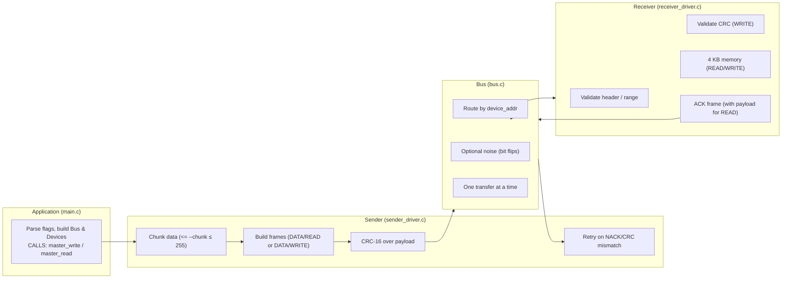
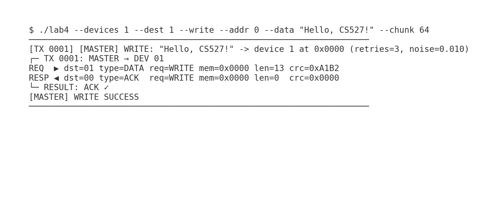
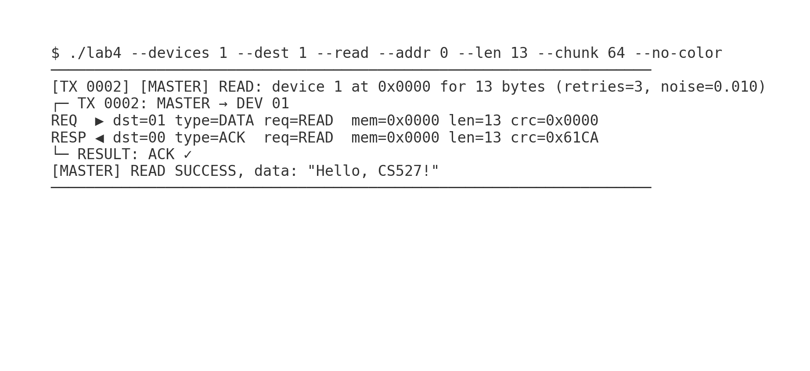
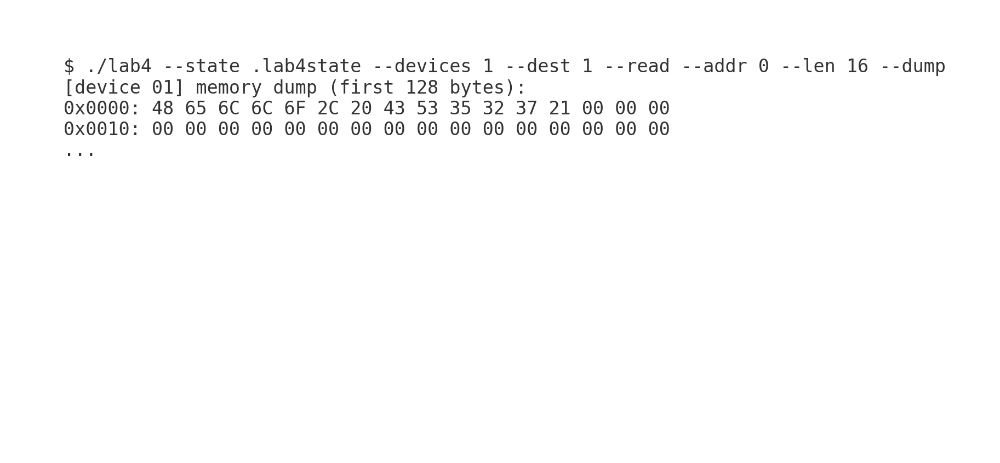

# Lab 4 — Master–Bus–Receiver Simulation (CRC-16, Persistence, Chunking)

**Course:** Computer Systems (CS527)  
**Lab Assignment:** 4  
**Name:** Rajeshwar Singh  
**Entry Number:** 2025CSMxxxx  
**College:** Indian Institute of Technology Ropar  
**Program:** M.Tech (CSE)

---

## TL;DR (Quick Start)

```bash
make
./lab4 --devices 1 --dest 1 --write --addr 0 --data "Hello, CS527!"
./lab4 --devices 1 --dest 1 --read  --addr 0 --len 13
```

Use persistence across runs:
```bash
./lab4 --state .lab4state --devices 1 --dest 1 --write --addr 0 --data "Hello, again!" --chunk 4
./lab4 --state .lab4state --devices 1 --dest 1 --read  --addr 0 --len 13 --chunk 4
```

> Tip: `make clean` removes objects, binary, and `.lab4state/`.

---

## What this project is

A simulation of a **single-master bus** with **N receivers (devices)**. The master sends READ/WRITE requests in framed chunks with **CRC-16/CCITT** for integrity. The bus routes to the right device and can inject **noise** (bit flips). Devices validate headers and CRC, then read/write a small **4 KB memory** and respond.

**Key features**
- **Chunked frames**: `--chunk N` (1..255), default 255
- **CRC-16/CCITT-FALSE** on every payload
- **Retries** on NACK/CRC mismatch: `--retries R` (default 3)
- **Noise simulation**: `--noise P` (0.0..1.0)
- **Persistence**: `--state DIR` saves device RAM to `DIR/dev_XX.bin`

---

## Architecture



### Frame format

```
device_addr (6-bit) | packet_type (DATA/ACK) | request_type (READ/WRITE)
mem_addr   (16-bit) | length (0..255)        | data[0..length-1] | checksum (CRC16 of data)
```

- Master sends **DATA** frames (READ/WRITE requests)
- Receiver replies with **ACK** frames; READ ACK includes payload + CRC

---

## Repository structure

```text
.
├── Makefile
├── constants.h            # Tunables (frame size, memory size, CRC params, limits)
├── crc16.c / crc16.h      # CRC-16/CCITT implementation
├── frame.c / frame.h      # Frame struct + checksum helpers + summary printer
├── logger.c / logger.h    # Simple color logger + banners
├── bus.c / bus.h          # Bus: routing, noise, busy lock
├── receiver_driver.c      # Device side: read/write memory, CRC verify
├── receiver_application.c # Device helpers (memory dump)
├── receiver.h
├── sender_driver.c        # Master side: chunking, build frames, retries, CRC validate
├── sender_driver.h
├── sender_application.c   # Convenience wrappers for strings
└── main.c                 # CLI, orchestration, persistence
```

---

## Build

Requirements: **gcc/clang** and **make** (Linux/macOS; Windows via WSL or MSYS2/MinGW).

```bash
make
make clean
```

---

## CLI Reference (flags)

- `--devices N` : number of devices (1..63)
- `--dest D`    : destination device address (1..N)
- `--write`     : perform WRITE
- `--read`      : perform READ
- `--addr A`    : start memory address (0..4095)
- `--data "S"`  : string payload for WRITE
- `--len L`     : number of bytes to READ
- `--retries R` : retries per frame (default 3)
- `--noise P`   : noise probability 0..1 (default 0.01)
- `--dump`      : print first 128 bytes of each device after run
- `--state DIR` : persist device memory in `DIR/dev_XX.bin`
- `--chunk N`   : frame payload size 1..255 (default 255)
- `--verbose` / `--quiet` / `--no-color` / `--help`

---

## Common scenarios & commands

### 1) Basic WRITE → READ (same run)
```bash
./lab4 --devices 1 --dest 1 --write --addr 0 --data "Hello, CS527!"
./lab4 --devices 1 --dest 1 --read  --addr 0 --len 13
```




### 2) Persistence across runs
```bash
./lab4 --state .lab4state --devices 1 --dest 1 --write --addr 0 --data "Hello, CS527!"
# New process / later...
./lab4 --state .lab4state --devices 1 --dest 1 --read  --addr 0 --len 13
```

### 3) Change frame size (chunking)
```bash
./lab4 --devices 1 --dest 1 --write --addr 0 --data "long message ..." --chunk 64
./lab4 --devices 1 --dest 1 --read  --addr 0 --len 64 --chunk 64
```

### 4) Simulate noise (retries will kick in)
```bash
./lab4 --devices 1 --dest 1 --write --addr 0 --data "robust!" --noise 0.10 --retries 5
```

### 5) Multiple devices (each has its own RAM/state file)
```bash
./lab4 --state .lab4state --devices 3 --dest 2 --write --addr 128 --data "for device 2"
./lab4 --state .lab4state --devices 3 --dest 3 --write --addr 256 --data "for device 3"
./lab4 --state .lab4state --devices 3 --dest 2 --read  --addr 128 --len 12
```

### 6) Dump device memory (first 128 bytes)
```bash
./lab4 --state .lab4state --devices 1 --dest 1 --read --addr 0 --len 16 --dump
```



### 7) No color / quiet / verbose
```bash
./lab4 --devices 1 --dest 1 --write --addr 0 --data "no color" --no-color
./lab4 --devices 1 --dest 1 --write --addr 0 --data "shh"      --quiet
./lab4 --devices 1 --dest 1 --write --addr 0 --data "details"  --verbose
```

### 8) Edge cases (expect failure/NACK)
```bash
# Out-of-range write
./lab4 --devices 1 --dest 1 --write --addr 4090 --data "0123456789"

# Read more than MAX_DATA_LEN in one frame -> split with --chunk
./lab4 --devices 1 --dest 1 --read  --addr 0 --len 512 --chunk 128
```

---

## How things work (short version)

- **Sender (master)** splits data into chunks (`--chunk`), builds frames with headers and **CRC-16/CCITT**, and sends over the bus. On NACK or bad CRC, it **retries**.
- **Bus** enforces **one transfer at a time**, optionally flips a random bit (according to `--noise`) in the request or response, and routes to the **right device**.
- **Receiver (device)** checks header/range; for **WRITE** it verifies CRC then writes bytes; for **READ** it copies bytes to the ACK and adds **CRC** so the master can validate.
- **Persistence** writes/reads `dev_XX.bin` files when `--state DIR` is used.

---

## Git: init and push

```bash
git init
git add .
git commit -m "Lab 4: Master–Bus–Receiver Simulation with CRC, chunking, persistence"
git branch -M main
git remote add origin <YOUR_REPO_URL>
git push -u origin main
```

**Recommended `.gitignore`:**
```gitignore
lab4
*.o
*.d
.lab4state/
```

---

## Troubleshooting

- **Read shows nothing:** Use the **same `--state DIR`** for the WRITE and READ runs; ensure `--len` matches what was written.
- **Lots of NACKs:** Reduce `--noise`, increase `--retries`, or use smaller `--chunk`.
- **Weird colors:** add `--no-color`.
- **Windows:** use **WSL** or MSYS2/MinGW to get `make` + `gcc`.

---

## License

Educational use, CS527 coursework.
